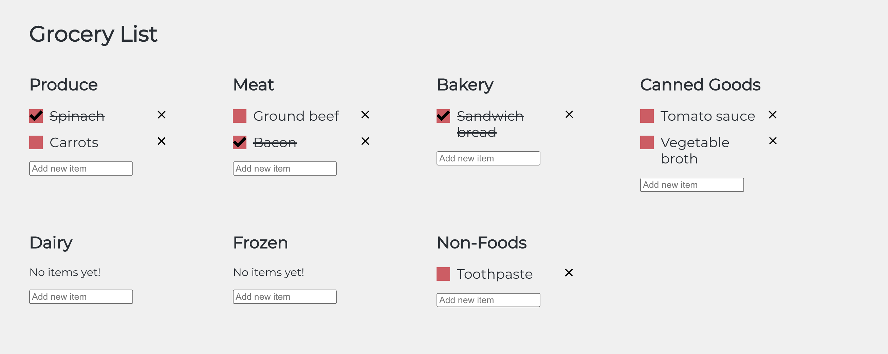
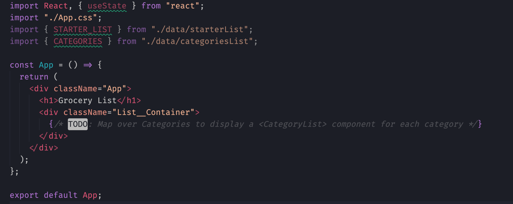
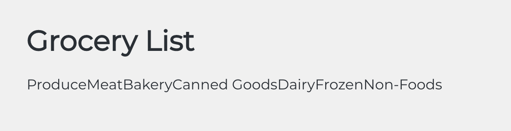
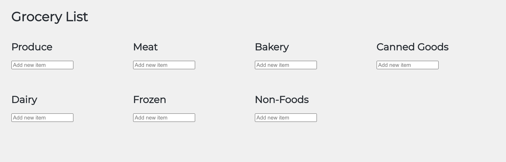
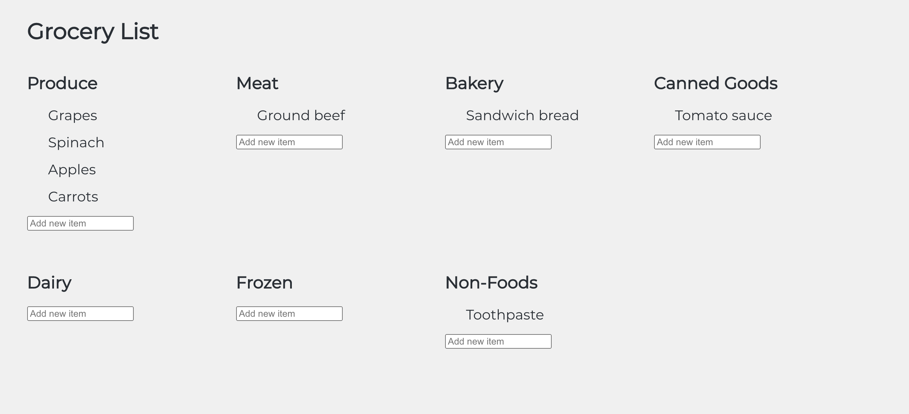
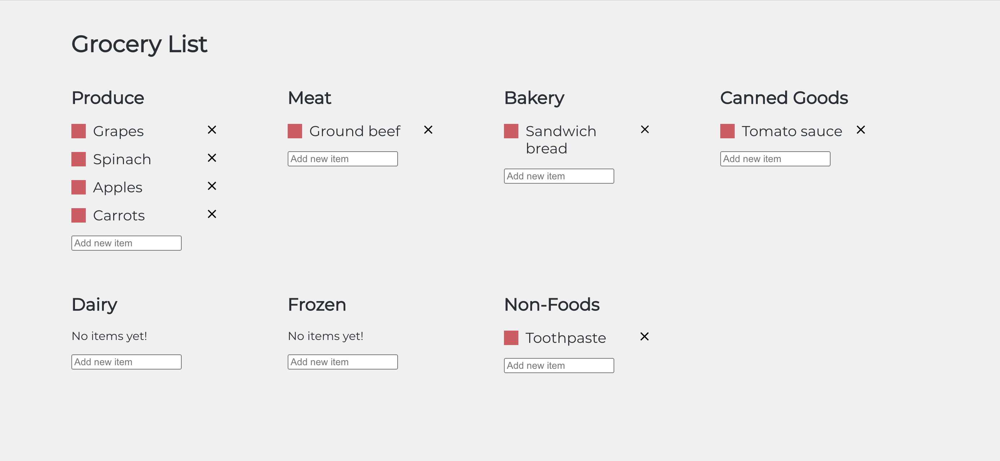
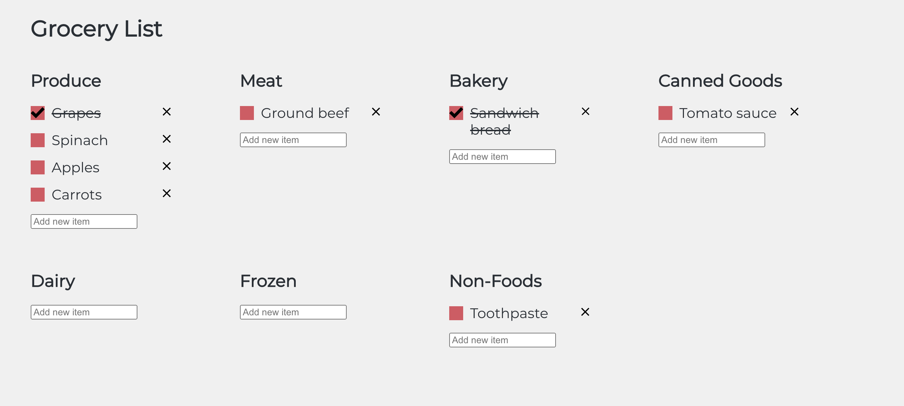

# CoderGirl-FrontEnd_Studio6

This studio is based off of section 5 of your Udemy course - Rendering Lists & Conditional Content. In this project you will practice rendering content from an array of data.

You are building an app that lets a user build a grocery list where they can add items, check them off and remove them. The items are all organized in categories based on sections of a grocery store. Despite visually looking like there are many lists, we are going to use **one** state variable to hold all the grocery items.
The finished project should look like this:



## Getting Started

### A. Fork & clone the repository from GitHub.

- [ ] Navigate to the [CoderGirl-FrontEnd_Studio6 project repository](https://github.com/kirbykatie/CoderGirl-FrontEnd_Studio6).
- [ ] Fork the repository to your own account, then grab the link from the green Code dropdown.
- [ ] In your terminal, go to the folder where you want your project to be. Use git clone to create your local copy.

### B. Get the project ready to code.

- [ ] In VSCode (or the IDE of your choice), open the project so you can view the code. You should already be in the main branch, which is where the starter code resides.
- [ ] Open a terminal inside your VSCode. Your terminal should already be inside the CoderGirl-FrontEnd_Studio6 directory. Then use the command npm install to download any required dependencies.
- [ ] Now use the command npm start to serve the project to your browser. You should only see the title 'Grocery List' in the browser

## Part 1 - Creating a list for each category

### A. Reviewing Provided Data

In the file explorer sidebar, navigate to `/src/data`. There should be two files inside: `categoriesList.js` and `starterList.js`. Open up `starterList.js`.
This file holds the const variable `STARTER_LIST`. It's an array of objects, where each object has 3 properties:

- `name`: string, the name of the grocery item
- `checked`: boolean, determines if the item is checked or not
- `category`: string, the name of the category the item belongs to

Then open the other file in the data directory: `categoriesList.js`. This file holds the const variable `CATEGORIES`. It's an array of string, each element holding the name of a category that corresponds with the category property in `STARTER_LIST`.

You will eventually loop over both of these arrays to use the data to create your grocery list.

_Note: You may be wondering why `STARTER_LIST` and `CATEGORIES` are in all capital letters with an underscore separating words. This is a naming convention that many developers from many disciplines use to indicate a constant. In Javascript, it's becoming common to declare every variable that won't be changed with `const`. However, just because a variable is declared with `const` doesn't mean it should be written in all caps. This naming convention should only be used to refer to data that should never be changed by the program, but may occasionally be changed by the developer as business needs change.
For instance, `CATEGORIES` right now has 7 elements, but maybe in the future you want to add an 8th category. Another example is in an app that calculates the totals of items, there could be a constant called `TAX_RATE` that is always assigned the value of the current local tax rate. That rate could change in the future, so the developer would need to adjust the value._

### B. Setting up App.js - Mapping over Categories



Inside `App.js`, the two arrays you just looked at are imported at lines 3 & 4.

- [ ] Look at the TODO at line 14. Here you will use the array method `.map()` to map over each element of the `CATEGORIES` array. Remember that baby steps are important! Before attempting to implement `<CategoryList>`, first confirm you can render each element inside the `CATEGORIES` array as a `<p>` element.

Tips:

- Remember to wrap expressions in JSX inside of `{ }`
- [Refer to MDN's `Array.prototype.map()` documentation](https://developer.mozilla.org/en-US/docs/Web/JavaScript/Reference/Global_Objects/Array/map) to remind yourself how to use `.map()`

Your app will look a little funky once this step is completed. Don't worry! That will be fixed in the next step.



### C. Setting up App.js - Rendering `<CategoryList>`

- [ ] Take a look at `/src/components/CategoryList.js`. There is 1 prop being passed to the component already - `categoryName`. You know then that you will need to pass a prop named `categoryName` when rendering this component inside of `<App>`. (Note: you will be adding more props as you continue!)
- [ ] Before you can render `<CategoryList>` you need to import the component. Inside of `App.js`, at the top with your import statements, import `CategoryList`.
- [ ] Next, replace the placeholder `<p>` element you made inside your `CATEGORIES.map()` expression with a `<CategoryList>` component. Here you will pass the name of each category as the prop `categoryName`
- [ ] Don't forget to add the `key` prop with a unique value. You could use the category name as the unique value.

Once complete, the app should now look like this:



## Part 2 - Displaying grocery items in its list

### A. Filtering the grocery list

- [ ] `<CategoryList>` will hold `<GroceryItem>` components for each grocery item. You first need to get the grocery list data to `CategoryList` to be passed to `<GroceryItem>`. Inside `<App>`, pass a second prop to `<CategoryList>` called `filteredGroceryList`.
- [ ] For the value of `filteredGroceryList`, you are going to use the [`.filter()` array method](https://developer.mozilla.org/en-US/docs/Web/JavaScript/Reference/Global_Objects/Array/filter) to only pass the grocery items for that category. That will look something like this:

```javascript
filteredGroceryList={STARTER_LIST.filter(item =>
  // what should go here?
  // Remember filter will return every array element that equates to true when tested against the provided function
)}
```

### B. Mapping over `filteredGroceryList`

- [ ] Inside `<CategoryList>`, add `filteredGroceryList` to the destructured props object. If you have React Developer Tools installed, this is a great time to open your dev tools inside the browser and see if `filteredGroceryList` is getting the data you expected. (Note: Install React Dev Tools by searching for it in google in your preferred browser and select your browser's webstore in the results. You should see the React logo and many installs and reviews. Add the extension to your browser. You then will be able to access information on each componenet's state, props and more through the browser's developer tools.)
- [ ] Then you will once again map over `filteredGroceryList` to return a JSX expression to display the grocery item. Before rendering the `<GroceryItem>` component, let's make sure it works by displaying the name of the item as an `<li>` element

Once complete, the app should now look like this:



### C. Rendering `<GroceryItem>`

- [ ] Take a look at `/src/components/GroceryItem.js`. The JSX has already been set up for you. Again there is 1 prop already being passed, `item`. This is an object from the `STARTER_LIST` array.
- [ ] Just as you did for rendering `<CategoryList>`, you will import `GroceryItem` inside of `CategoryList.js`. Then replace the `<li>` element with a `<GroceryItem>` component, passing the grocery item object as the `item` prop.
- [ ] Don't forget to add the `key` prop with a unique value.

Once this is complete, you should see an empty checkboxe and a delete button appear with each item. However, nothing will happen when you click either. We need to set up the event handlers and state to interact with the grocery list.



## Part 3 - Making the grocery items checkable

### A. Creating the `groceryList` state variable

- [ ] In order to change anything about the grocery list, you need to create state. Return to `App` and create a state variable called `groceryList` with `STARTER_LIST` as the initial value.
- [ ] You then need to change the expression inside `<CategoryList>`'s `filteredGroceryList` prop to filter over your new state variable instead.
- [ ] Since you will be updating `groceryList`'s value in the children components, you'll need to pass the setter function as a prop to `<CategoryList>` AND `<GroceryItem>`

### B. Adding an Event Listener when a checkbox is clicked

- [ ] In `GroceryList.js`, an onClick attribute has already been added with `handleItemClick()` getting called every time the item name is clicked. The expected behavior when this event occurs is to either check or uncheck the grocery item's checkbox. This means updating `groceryList`'s value to reflect the new state. To do this, we'll use `groceryList`'s setter function.

Tips:

- This update relies on using the previous state
- Use the `.map()` again to map over the array of grocery item objects. `.map()` will return a new array, so you can add logic to look for the object that is changing, returning all the other objects as is.
- When updating the 1 object that is getting updated, use destructuring to keep all the original properities as-is, and only update the `checked` value.

When implemented correctly, items that are checked off look like this:



_Note: How is that styling getting added when `item.checked === true`? Look at the `<li>` inside the return. The `className` attribute has logic in place to add a `checked` class when the item is checked. Styling in App.css specific to the `checked` class is then applied_

## Part 4 - Adding new grocery items

### A. Updating the `<input>` element

- [ ] You are now going to update the `<input>` element at the bottom of the return in `CategoryList.js`. First, with any text inputs in a React project, you will need a state value to hold the value of the text in the input. Create a state variable called `inputVal` and the initial value should be an empty string.
- [ ] Replace the empty string in the `<input>`'s `value` attribute to be the new state variable. Then update the `onChange` event handler to update `inputVal` to whatever was entered. (Hint: you can access the text entered by using the event object's `target.value` property)

### B. Adding a new item object to the `groceryList`

You should now be able to write text into the text box under each category. However, we still need to add the text as a new item object. To make this app cleaner, I decided to not use a submit button and rely on the user pressing 'enter' on their keyboard instead. So you will need to update the `onKeyPress` event handler function. Note that `handleInputKeyPress()` has some logic already provided - the event will run anytime any key is pressed (including when a user is entering the item name), but with the conditional provided `if (e.key === "Enter")`, the if statement will only evaluate to true if the enter key is pressed.

- [ ] Inside the if statement, update the groceryList state. However, you can't just run `setGroceryList(newItemObj)` - that will replace the entire array with just the one object. Instead, you need to destructure the previous state and add on your new object. Remember that the item added should have 3 properties, not just the name

### C. Improving upon basic functionality

- [ ] At this point, the basic functionality is there - when the user presses 'enter', whatever text is in the text box will be added to the list. However, there's some pain points we can easily address.
  - Can you reset the text box so the user doesn't have to manually remove the text after adding an item?
  - The user can press 'enter' without adding any text and an empty item is added. How can you prevent this?

## Part 5 - Deleting grocery items

- [ ] Return to `GroceryItem.js`. You have one last event handler function to update - `handleDelBtnClick()` which is already connected to the delete button. Once again, you are going to loop over the objects in the array, however this time you can use the `.filter()` method to return an array with only the objects that were not clicked.

## Part 6 - Conditionally displaying content in lists

- [ ] Finally, let's add a condition that displays 'No items yet!' when there are no items in a category. In `CategoryList.js` use a ternary operation to display 'No items yet!' inside a a `<p>` element if the array of grocery item objects the component receives is empty.

## Bonus Missions

TBD
